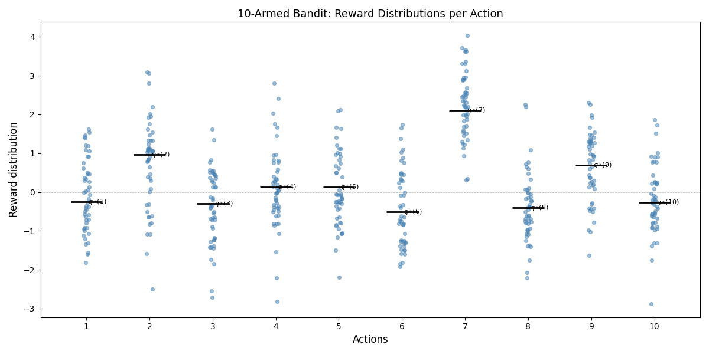
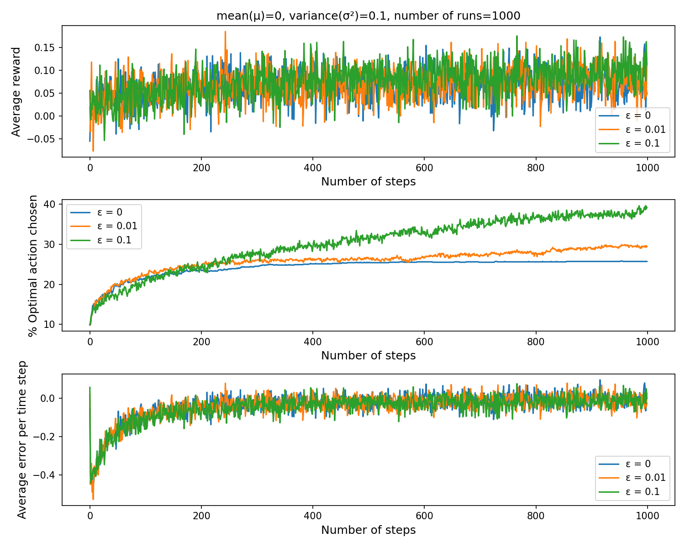
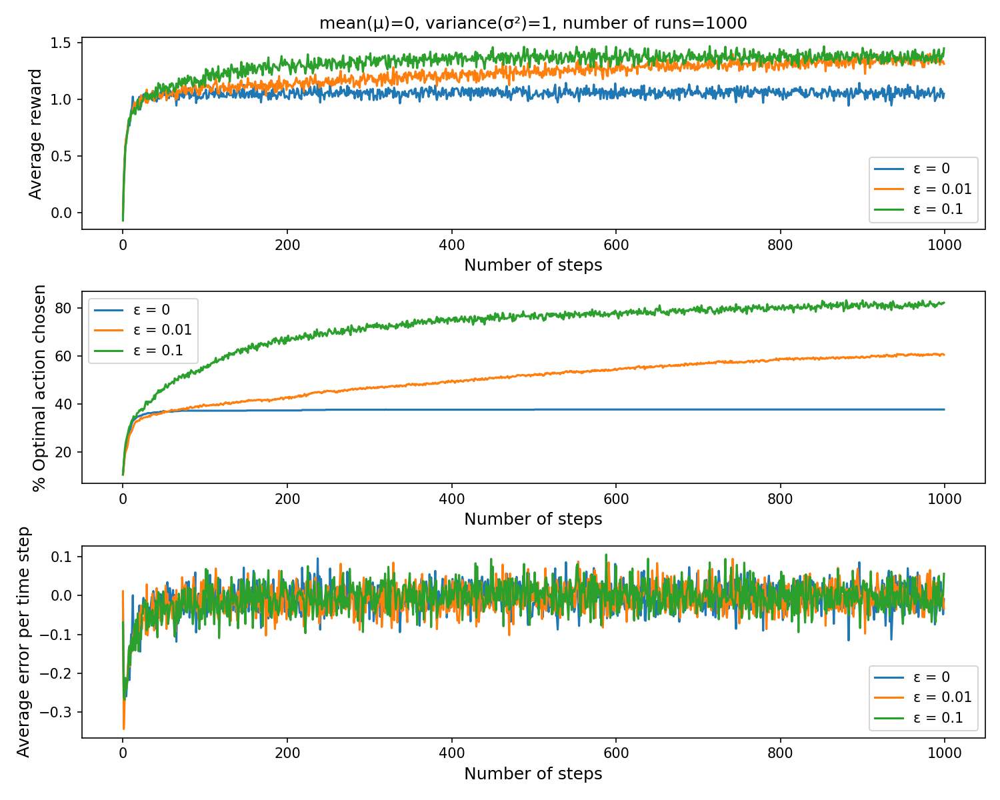
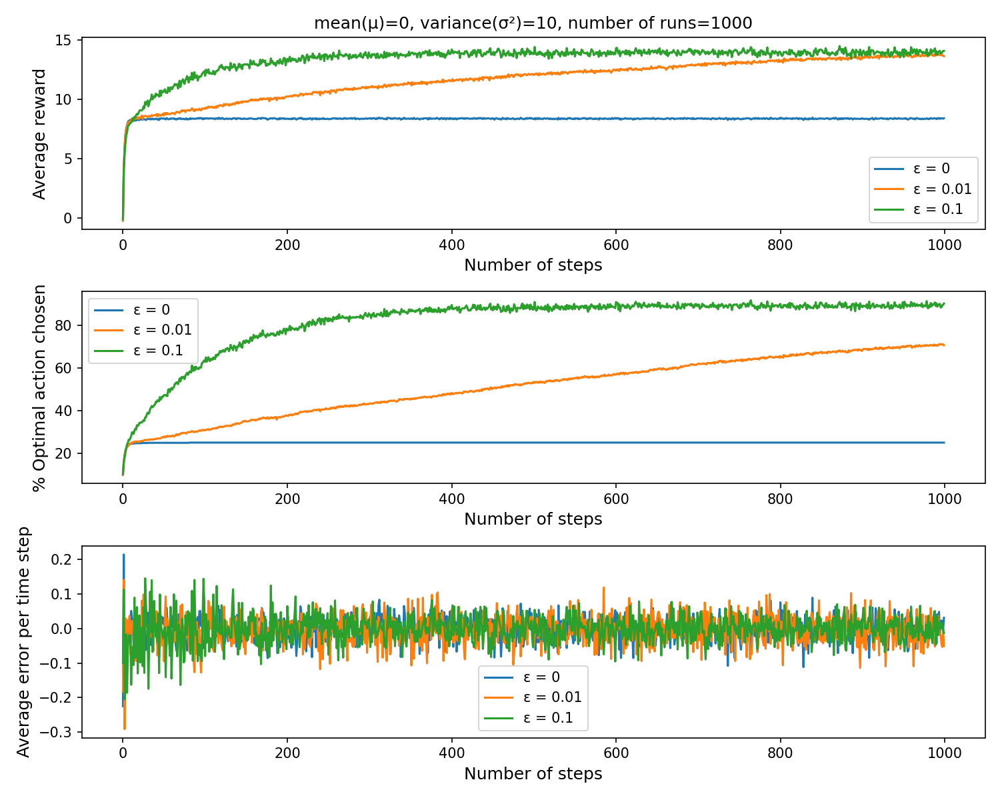
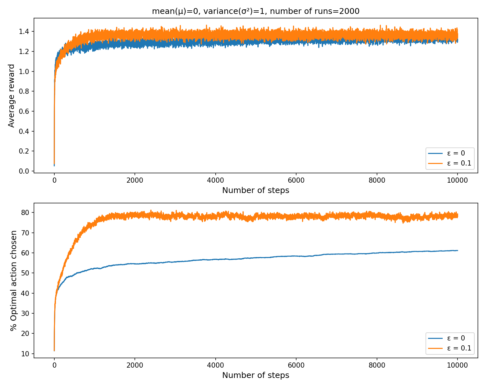
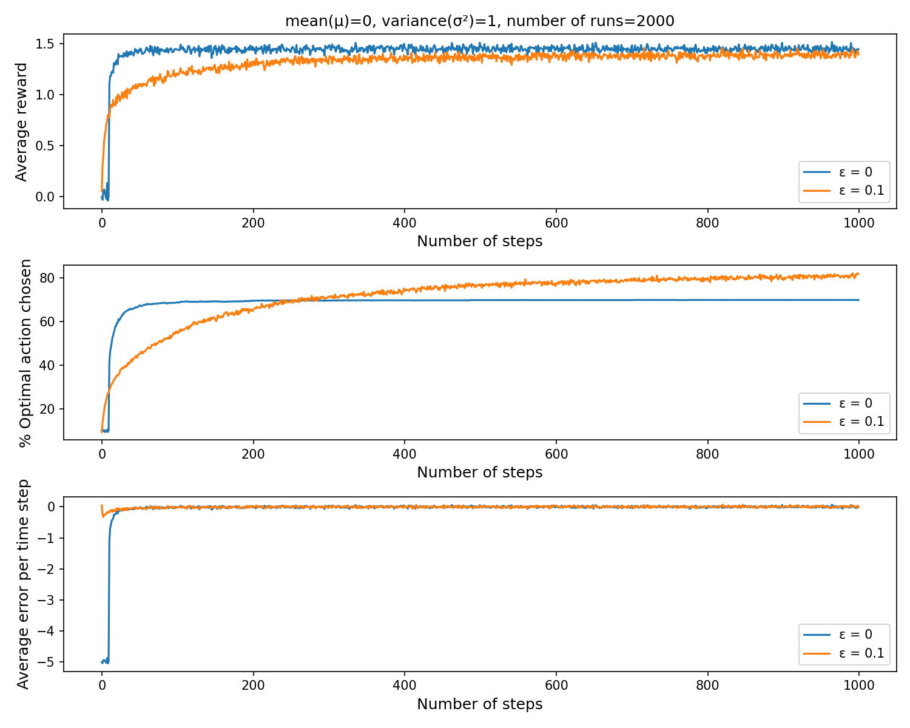
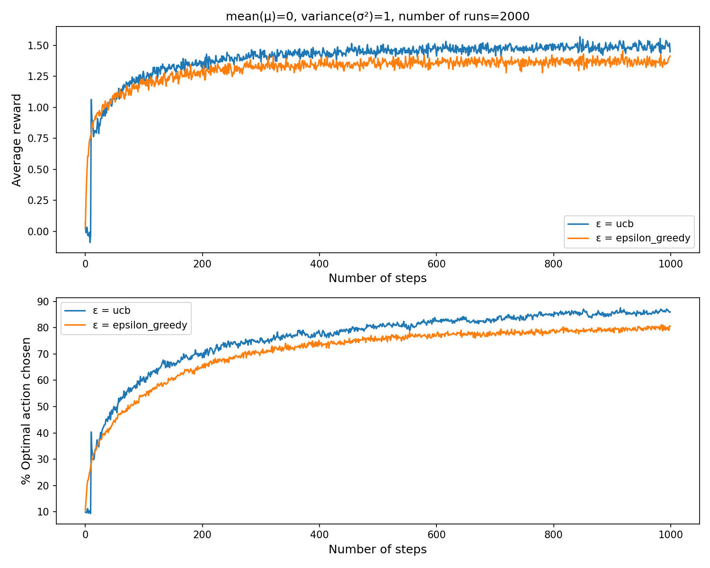

# K-Armed Bandit

Implementations of k-armed bandit strategies from **Sutton & Barto — Reinforcement Learning: An Introduction, Chapter 2**.

---

## Problem Setup

There are 10 arms. Pulling an arm produces a reward sampled from a normal distribution unique to that arm. The agent does not know the true reward distributions — it can only estimate them by interacting with the environment. The goal is to maximise cumulative reward over N steps.



---

## Key Concepts

### Action-value estimate
```
Q_t(a) = (Sum of rewards when action 'a' taken before t) / (Number of times 'a' taken before t)
```

### Greedy action selection
```
A_t = argmax Q_t(a)
```

### Epsilon-greedy action selection
```
if random() < epsilon:
    A_t = random action          # explore
else:
    A_t = argmax Q_t(a)          # exploit
```

### Incremental update (stationary)
```
Q_(n+1) = Q_n + (1/n) * (R_n - Q_n)
```

### Constant step-size update (non-stationary)
```
Q_(n+1) = Q_n + alpha * (R_n - Q_n)
```
Using a fixed `alpha` gives more weight to recent rewards, making the estimate track a changing environment.

---

## Implementations

### 1. Epsilon-Greedy — Stationary (`k_arm_bandit.py`)

Compares `ε = 0` (pure greedy), `ε = 0.01`, and `ε = 0.1` over 1000 steps and 1000 runs.

The effect of **reward variance** on strategy performance:

**Low variance (σ² = 0.1)** — rewards are consistent; greedy converges quickly.



**Medium variance (σ² = 1)** — standard setting from the book.



**High variance (σ² = 10)** — noisy rewards; greedy gets stuck, epsilon-greedy wins through exploration.



---

### 2. Non-Stationary Bandits (`k_arm_bandit_nonstationary.py`)

The true action values drift over time (small Gaussian noise added each step). Sample-average updates can't track this. A constant step-size `alpha = 0.1` is used instead to weight recent rewards more heavily.



---

### 3. Optimistic Initial Values (`k_arm_bandit_optimistic_initial_value.py`)

For the greedy method (`ε = 0`), action-value estimates are initialised to **Q = 5** (much higher than true means near 0). This forces early exploration — every arm gets tried before estimates settle — at the cost of a slow start.

```
if epsilon == 0:
    Q[:] = 5    # optimistic initialization encourages exploration
```

The initial spike in % optimal action is the signature of this technique: all arms are explored in the first ~10 steps before the agent converges.



---

### 4. Upper Confidence Bound — UCB (`k_arm_bandit_upper_confidence_bound.py`)

UCB selects actions based on both estimated value and uncertainty:

```
A_t = argmax [ Q(a) + c * sqrt( ln(t) / N(a) ) ]
```

Actions tried fewer times have a higher confidence bound, so they get explored. As `N(a)` grows, the bound shrinks and the agent exploits. The initial spike in the plots reflects all arms being tried before `N(a)` becomes significant.

UCB vs epsilon-greedy (ε = 0.1), over 1000 steps and 2000 runs:



---

## How to Run

```bash
# Epsilon-greedy (stationary, varying variance)
python k_arm_bandit.py

# Non-stationary bandit
python k_arm_bandit_nonstationary.py

# Optimistic initial values
python k_arm_bandit_optimistic_initial_value.py

# Upper confidence bound
python k_arm_bandit_upper_confidence_bound.py
```

Dependencies: `numpy`, `matplotlib`

---

## Reference

Sutton, R. S., & Barto, A. G. (2018). *Reinforcement Learning: An Introduction* (2nd ed.), Chapter 2.
